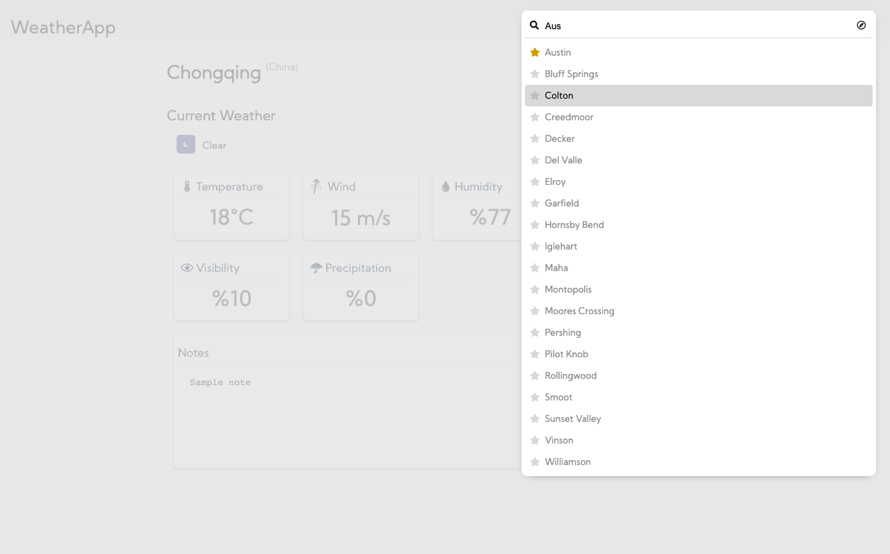
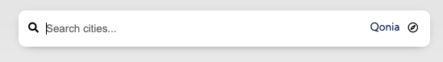
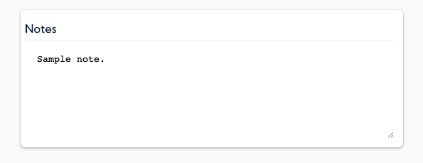
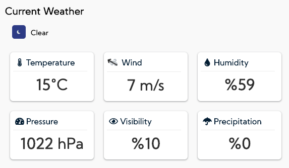
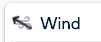

[Documentation Home](../README.md)

## Components

All components are functional components, there is no class component.

### Favourites Manager

- Designed to provide interface for Favorite Cities Feature
- Holds favourite states of items
- **Generic and ready to work standalone.**

### Search
- Designed to provide interface for searching items.
- Takes search method, rowRenderer as parameter.
- Responds Enter and Esc keys to increase usability
- UI responds loading and error states
- **Generic and ready to work standalone.**

### UserLocation

- Uses `HTML5 geolocation API` and provides icon.

### CitySearch

- Designed to provide interface to Search cities and locate user
- Encapsulates Search component. Uses UserLocation component.
- Users can add/remove cities on results to favourites quickly.
- Clicking on search result navigates to city details
- Clicking on "UserLocation" icon asks user for location permission. And navigates user to found city. 
- City of given location is cached and visible near icon to increase UX. User can quickly navigate to that city.

Search Input UI after user give location permission.

### Notes

- Stores user notes about cities
- Saves note to local storage real-time

### Weather

Arrow on wind card shows the direction of wind. Properity of this design can be discussable.

