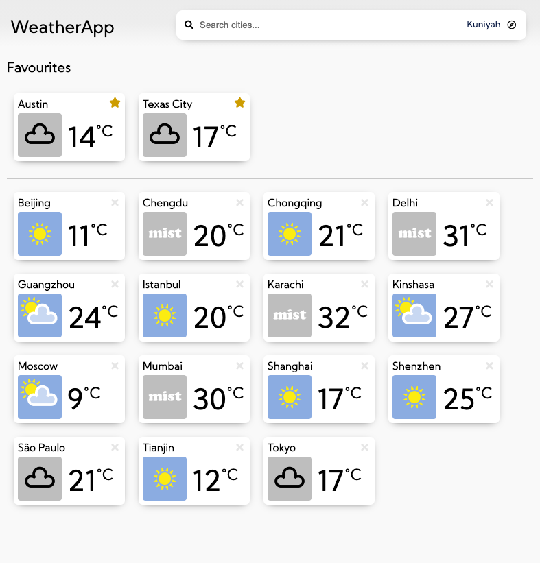
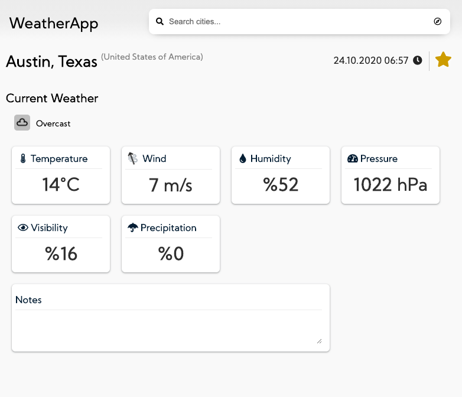
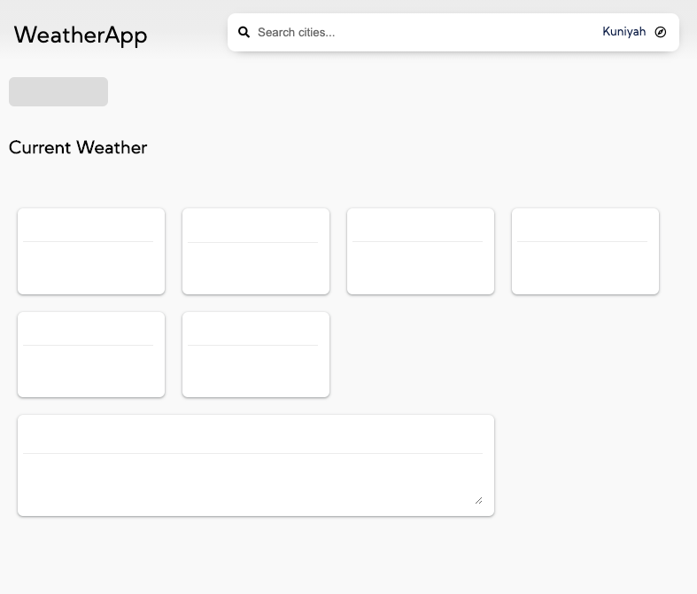
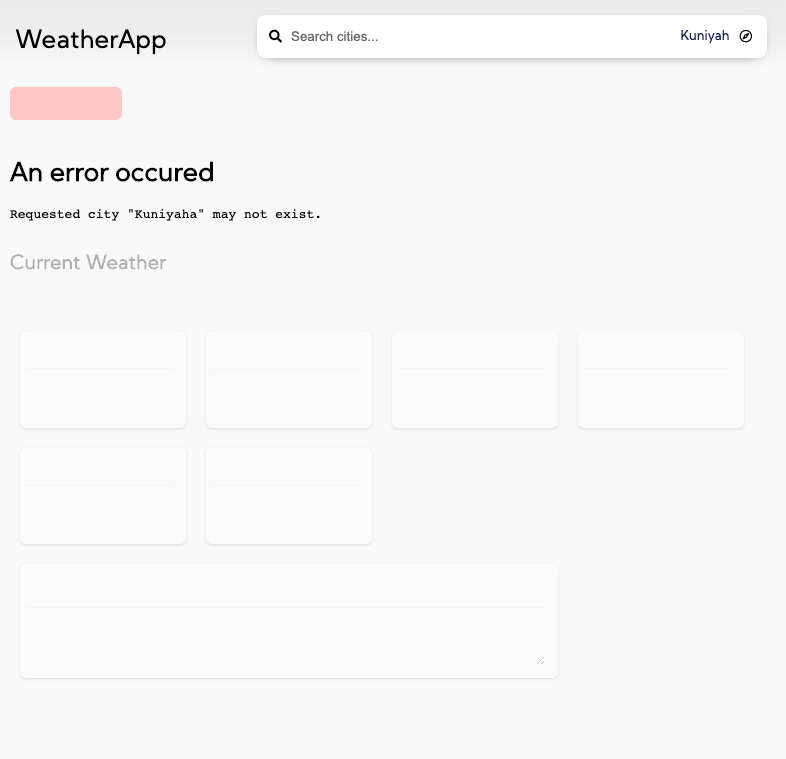

[Documentation Home](../README.md)
## Shell

App Shell consists of fixed header and dynamic page router.
Header has "Application Name that provides link to Home Page" and a "Search bar search cities, locate user"

## Pages

### Home Page

- Users see 15 largest city in the world listed in alphabetical order by default. 
- Users can remove these cities individually by clicking remove icon.
- Clicking a city will navigate to city details page
- Users see favourite cities.

### City Details

- Users can see current weather details such as `Temperature`, `Wind`, `Humidity`, `Pressure`, `Visibility`,`Precipitation` and `observation time`.
- User can add/remove city to favourites.
- User can take notes about city.
- Updates weather information regularly.
- Update interval can be specified in project config.
- UI responds loading and error states

